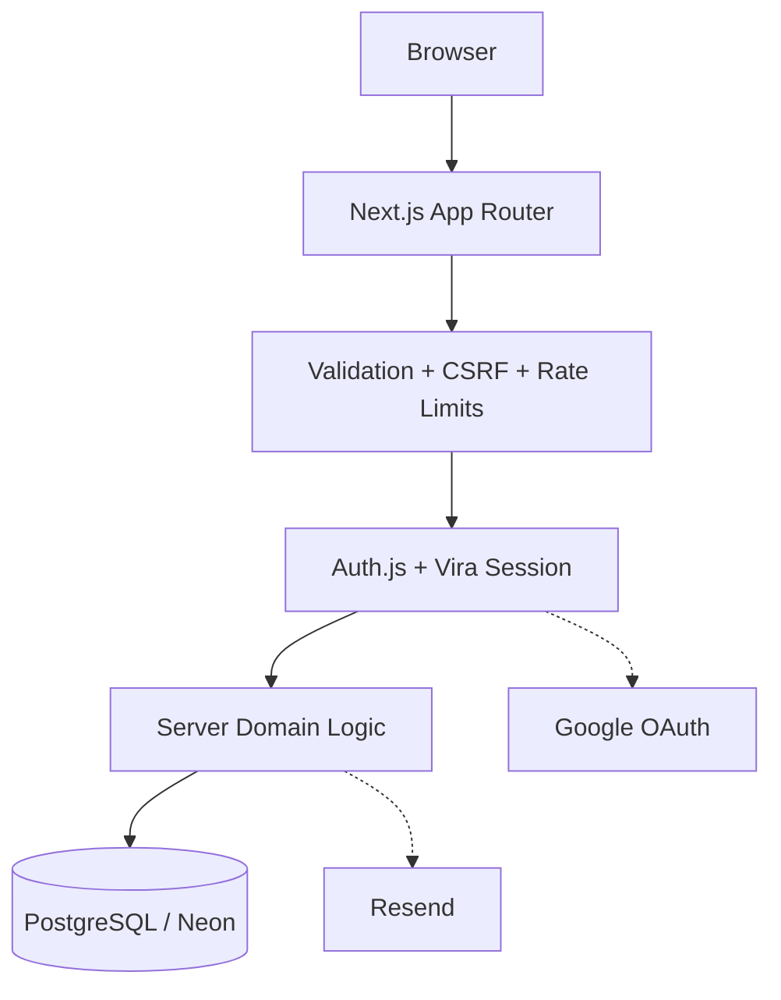
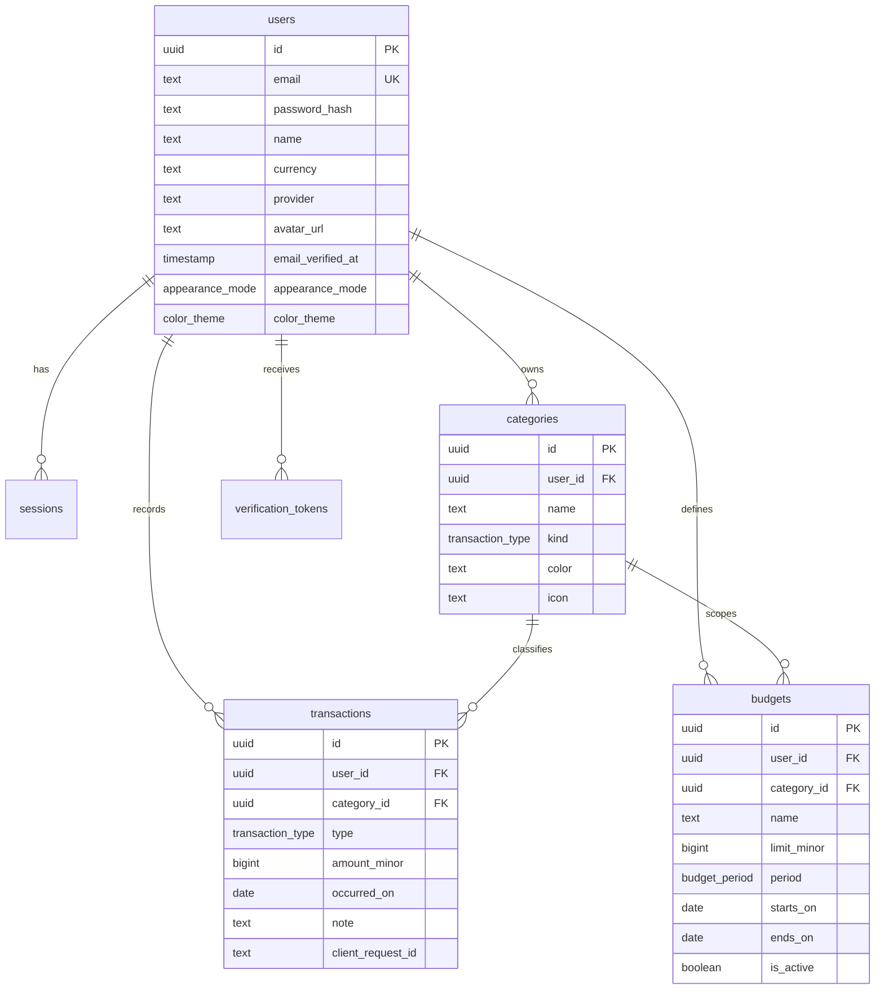

<p align="center">
  <picture>
    <source media="(prefers-color-scheme: dark)" srcset="https://raw.githubusercontent.com/nextern-dev/Vira/main/public/brand/vira-logo-light.svg" />
    <source media="(prefers-color-scheme: light)" srcset="https://raw.githubusercontent.com/nextern-dev/Vira/main/public/brand/vira-logo.svg" />
    
  </picture>
</p>

<p align="center">
  <strong>Personal finance, without the complexity.</strong>
</p>

<p align="center">
  A production-oriented, open-source expense tracker built with Next.js, PostgreSQL, and TypeScript.
</p>

<p align="center">
  <a href="https://vira.nextern.ir">Live Demo</a>
  &nbsp;·&nbsp;
  <a href="https://github.com/nextern-dev/Vira">Repository</a>
  &nbsp;·&nbsp;
  <a href="LICENSE">MIT License</a>
</p>

<p align="center">
  
  
  
  
  
</p>

# Vira

Vira is a full-stack personal expense tracker created by **Nextern**. The project keeps the product scope focused while treating authentication, authorization, data integrity, secure money handling, validation, and deployment as real production concerns.

## Overview

Vira provides a focused workflow for managing everyday personal finances:

- Track income and expenses.
- Organize transactions with personal categories.
- Create budgets and monitor spending progress.
- Review summaries, category breakdowns, and six-month trends.
- Import and export transactions through CSV.
- Sign in with email/password or Google.
- Verify email addresses and reset passwords securely.
- Keep application data isolated per user.

## Engineering Highlights

| Concern | Approach |
| --- | --- |
| Authentication | Auth.js v5 for Google OAuth with a Vira-owned opaque application session |
| Authorization | Protected data access is scoped to the authenticated `user_id` |
| Password security | `scrypt` hashing with per-password salts and timing-safe comparison |
| OAuth security | Google accounts require a verified email assertion before linking |
| Session security | SHA-256 session token hashes stored server-side with an `httpOnly` cookie |
| CSRF protection | Origin/Host verification for state-changing requests |
| Validation | Server-side Zod validation with bounded request payloads |
| Money | PostgreSQL `bigint` minor units instead of floating-point amounts |
| Idempotency | Unique `(user_id, client_request_id)` constraint prevents duplicate transaction writes |
| Data integrity | Foreign keys, unique constraints, indexes, transactions, and atomic operations |
| Imports | Validation, row limits, ownership checks, and CSV formula-injection protection |
| Rate limiting | Optional shared Upstash Redis limiter with an in-process fallback |
| HTTP security | CSP, `nosniff`, strict referrer policy, permissions policy, and frame restrictions |
| Observability | Structured server logging and a `/api/health` readiness endpoint |

## Features

### Finance

- Income and expense transactions
- User-owned categories
- Active budgets and spending progress
- Spending summaries and category breakdowns
- Six-month spending trends
- Integer-based monetary calculations

### Authentication

- Email/password authentication
- Google OAuth through Auth.js
- Verified-email check for Google account linking
- Vira-owned opaque session management
- Persistent Google profile avatars
- Email verification with expiring tokens
- Password reset with short-lived, single-use tokens
- Existing application sessions invalidated after password reset

### Data Management

- CSV export based on active ledger filters
- CSV import with header detection and preview
- Validation before persistence
- Atomic bulk insertion for valid imports
- Transaction idempotency through client request identifiers

### Application

- Global command palette and keyboard shortcuts
- Quick action for creating a new record
- Light/dark appearance modes
- Five stored appearance palettes
- Appearance synchronization between browser tabs
- Responsive application shell

## Architecture



Authentication and application authorization are intentionally separated. Auth.js handles the OAuth exchange, while protected application requests rely on Vira's server-side opaque session. Domain operations then enforce ownership before reading or mutating user data.

## Data Model



## Tech Stack

- **Next.js 16** — App Router, Server Components, Route Handlers, Turbopack
- **React 19**
- **TypeScript** — strict mode
- **PostgreSQL** — relational persistence and database constraints
- **Drizzle ORM** — typed SQL access and schema management
- **Auth.js v5** — Google OAuth integration
- **Resend** — transactional authentication email
- **Zod** — server-side input validation
- **Tailwind CSS v4** — application styling
- **Vercel + Neon** — production hosting and PostgreSQL

## Project Structure

```text
src/
├── app/                 # App Router pages and Route Handlers
├── components/          # Reusable application components
├── db/                  # Drizzle schema and database access
├── lib/
│   ├── auth/            # Application session and auth helpers
│   ├── validation/      # Shared validation logic
│   └── ...
└── auth.ts              # Auth.js configuration and OAuth bridge

drizzle/                 # SQL migrations and migration metadata
scripts/                 # Unit tests and project utilities
public/brand/             # Vira brand assets
```

## Run Locally

### Requirements

- Node.js 22+
- PostgreSQL 16+ or a compatible hosted PostgreSQL database
- npm

### Setup

```bash
git clone https://github.com/nextern-dev/Vira.git
cd Vira
npm install
cp .env.example .env
npx drizzle-kit push --force
node --experimental-strip-types --test scripts/test-units.mjs
npm run dev
```

Open `http://localhost:3000` once the development server is running.

## Environment Variables

| Variable | Required | Purpose |
| --- | --- | --- |
| `DATABASE_URL` | Yes | PostgreSQL connection string |
| `DB_SSL_REJECT_UNAUTHORIZED` | No | SSL certificate override for supported providers |
| `GOOGLE_CLIENT_ID` | No | Enables Google sign-in |
| `GOOGLE_CLIENT_SECRET` | No | Enables Google sign-in |
| `AUTH_SECRET` | Production | Auth.js secret |
| `AUTH_TRUST_HOST` | No | Trust host information behind a proxy |
| `RESEND_API_KEY` | No | Transactional email delivery |
| `EMAIL_FROM` | No | Authentication email sender |
| `APP_URL` | No | Canonical URL for generated email links |
| `UPSTASH_REDIS_REST_URL` | No | Shared rate-limiter endpoint |
| `UPSTASH_REDIS_REST_TOKEN` | No | Shared rate-limiter credential |

Never commit production credentials or secrets to the repository.

## Testing & CI

The repository includes automated checks for core money, date, password, and application behavior. GitHub Actions runs the project with PostgreSQL and verifies the production path through schema setup, type checking, linting, tests, build, server startup, and a health probe.

Local checks:

```bash
npm run typecheck
npm run lint
node --experimental-strip-types --test scripts/test-units.mjs
npm run build
```

## Brand Assets

The repository keeps the brand assets intentionally small and GitHub-friendly:

| Asset | Path |
| --- | --- |
| Brand mark | `public/brand/vira-mark.svg` |
| Primary logo | `public/brand/vira-logo.svg` |
| Dark-background logo | `public/brand/vira-logo-light.svg` |

The README hero automatically switches between the primary and light logo based on the viewer's color scheme, avoiding the previous contrast issue.

## Open Source

Vira is released under the **MIT License**. You are free to use, modify, fork, and adapt the project under the terms of the license.

If you build on Vira, attribution is appreciated.

## About Nextern

Vira is an independent open-source project by **Nextern**, a digital product and software brand focused on practical, professionally engineered web applications and developer products.

## License

MIT License — Copyright (c) 2026 Vira contributors / Created by Nextern.
