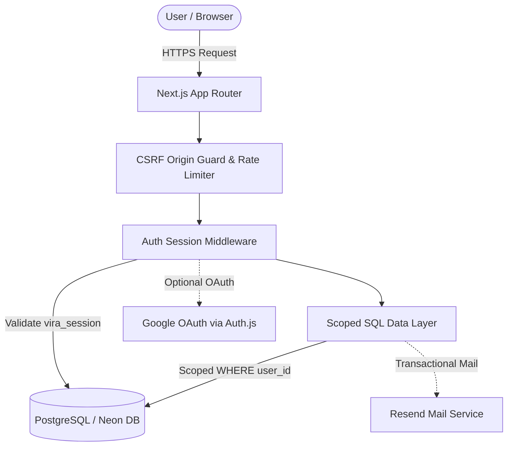
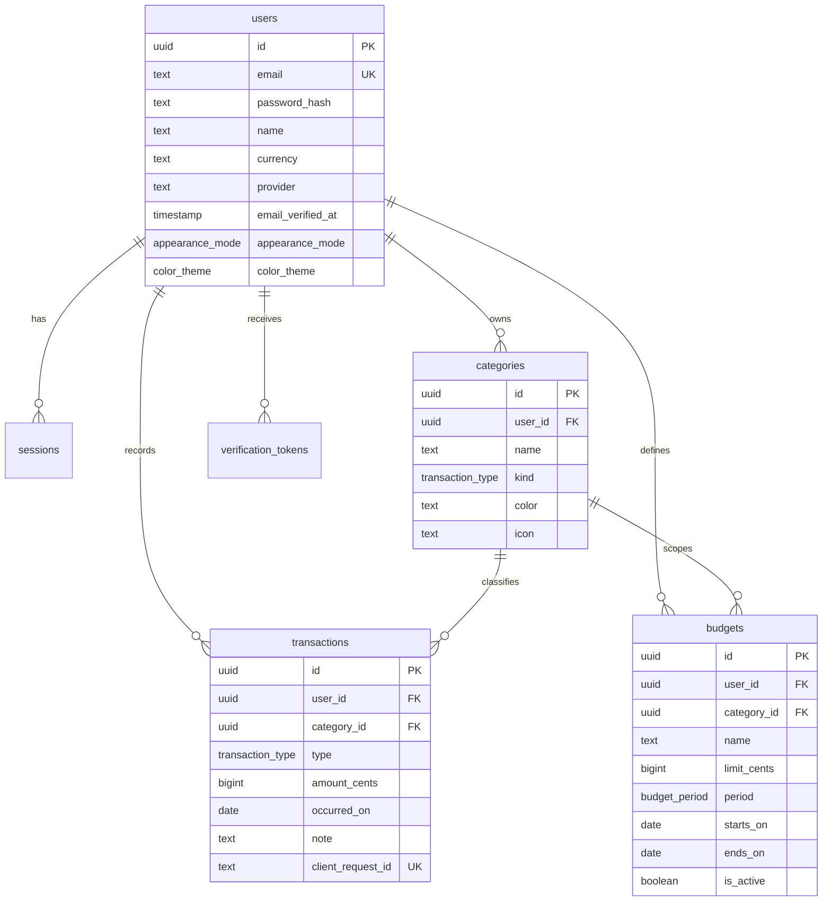

<p align="center">
  
</p>

<p align="center">
  
</p>

# Vira — Personal Expense Tracker

**Created by Nextern.** Free & open-source (MIT) — built as a production-grade portfolio piece. Feel free to fork, run, and adapt it; attribution appreciated.

A full-stack personal finance application built with **Next.js (App Router)**, **PostgreSQL** and **Drizzle ORM**. Vira lets authenticated users track income and expenses, organise them into custom categories, set budgets with real-time progress, and analyse spending through server-computed summaries, CSV tools and interactive command palettes.

## Feature overview

- **Power Tools** — Global **Command Palette (`⌘K` / `Ctrl+K`)** for instant keyboard navigation, action triggering (`N` for new record), and live theme palette switching.
- **CSV Import & Export** — 1-click live CSV export respecting active ledger filters, plus bulk CSV upload with automated header detection, preview table, and atomic database insertion.
- **Sign-in & OAuth** — Email + password, or **Google** via Auth.js broker. All OAuth flows issue and bridge into Vira's native opaque `vira_session` cookie.
- **Email Delivery (Resend)** — 24h email verification and 60min single-use password-reset tokens (hashed with SHA-256, single-use, all-sessions-invalidating).
- **Data Isolation & Security** — Strict per-account data scoping on every SQL query (`WHERE user_id = <session.userId>`), CSRF Origin verification, and rate limiting with optional Upstash Redis backend.
- **Transactions & Money Math** — Amounts stored strictly as whole minor units (`bigint` cents). Automated localization normalization for Persian and Arabic numerals.
- **Categories & Integrity** — User-defined categories with SVG icons and curated palettes. Deleting a category never destroys historical transactions (`ON DELETE SET NULL`).
- **Budgets & Analytics** — Real-time ledger recalculations, progress tracking, 6-month trends, and spending breakdowns aggregated purely on PostgreSQL.
- **Appearance System** — 5 curated palettes (Iris, Tide, Evergreen, Slate, Mulberry) across true Dark and Light modes, stored in database, synced across open browser tabs via `BroadcastChannel`.

## Architecture



## Database Schema (ERD)



## Engineering guarantees

| Concern | Implementation |
| --- | --- |
| Money | Stored as **integer minor units (cents)** in `bigint` — never floats |
| AuthZ | Every query is `WHERE user_id = <session user>`; IDs in URLs are validated UUIDs and return 404, never data |
| Input | All payloads validated server-side with Zod; unknown fields are dropped (no mass assignment) |
| CSRF | Every mutating request passes a strict **Origin == Host** check; session cookies are `httpOnly` |
| Rate limiting | Shared Redis window when `UPSTASH_*` is configured (multi-instance), in-process fallback |
| Idempotency | Unique `(user_id, client_request_id)` constraint on transactions; conflict → returns the original record |
| Integrity | FK cascades: user deletion removes sessions/categories/transactions/budgets; category deletion unassigns transactions |
| Indexes | User/date, user/type/date, user/category/date, unique email, token hash, idempotency key |
| Headers | CSP, `nosniff`, strict referrer policy, permissions policy, `frame-ancestors` allow-list |
| Passwords | `scrypt` (N=16384), timing-safe comparison, decoy-hash to equalise login latency |
| Observability | Structured JSON server logs (`src/lib/log.ts`), `/api/health` readiness endpoint |
| CI | GitHub Actions: PostgreSQL service, schema push, typegen, typecheck, lint, automated unit tests, build & health probe |

## Brand assets

All visual identity files live inside the app under `public/brand/` and are served directly by Next.js:

| Asset | Repository path | Public URL | Use |
| --- | --- | --- | --- |
| Brand mark | `public/brand/vira-mark.svg` | `/brand/vira-mark.svg` | App navbar, manifest, compact placements |
| Primary logo | `public/brand/vira-logo.svg` | `/brand/vira-logo.svg` | Light backgrounds and GitHub documentation |
| Light logo | `public/brand/vira-logo-light.svg` | `/brand/vira-logo-light.svg` | Dark backgrounds |
| Cover / social card | `public/brand/vira-cover.png` | `/brand/vira-cover.png` | GitHub cover, Open Graph and Twitter cards (1200×630) |

## Stack

- **Next.js 16** (App Router, Turbopack, Server Components + Route Handlers)
- **React 19**, **TypeScript** (strict mode)
- **PostgreSQL** with **Drizzle ORM**
- **Tailwind CSS v4** + custom semantic token theming
- **Auth.js v5** for Google OAuth bridging
- **Resend** for transactional authentication emails
- **Zod** for schema validation

## Running locally

```bash
# 1. Install dependencies
npm install

# 2. Configure environment
cp .env.example .env

# 3. Apply the database schema
npx drizzle-kit push --force

# 4. Run automated unit tests
node --experimental-strip-types --test scripts/test-units.mjs

# 5. Start development server
npm run dev
```

## Environment

| Variable | Required | Notes |
| --- | --- | --- |
| `DATABASE_URL` | yes | PostgreSQL connection string. For Neon: append `sslmode=require`. |
| `DB_SSL_REJECT_UNAUTHORIZED` | no | `false` only when the provider's chain is not trusted by the image (default strict). |
| `GOOGLE_CLIENT_ID` / `GOOGLE_CLIENT_SECRET` | no | Enables **Continue with Google** (Auth.js), bridge to `vira_session`. |
| `AUTH_SECRET` | no | JWT secret for the Auth.js OAuth leg (32+ bytes, `openssl rand -base64 32`). |
| `AUTH_TRUST_HOST` | no | Set `"true"` when served behind a proxy (Vercel, Arena preview, etc.). |
| `RESEND_API_KEY` / `EMAIL_FROM` | no | Enables real email delivery (verify + reset). Without it, dev logs a structured outbox. |
| `APP_URL` | no | Canonical URL used in email links (defaults to localhost in dev). |
| `UPSTASH_REDIS_REST_URL` / `UPSTASH_REDIS_REST_TOKEN` | no | Shared rate limiting (multi-instance safe). |

## License

MIT License — Copyright (c) 2026 Vira contributors / Created by Nextern.
