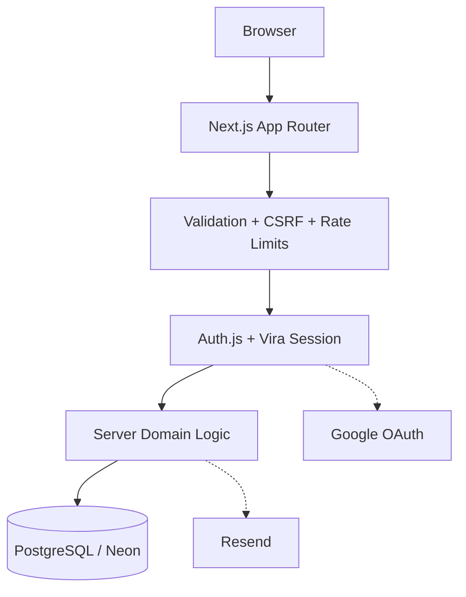
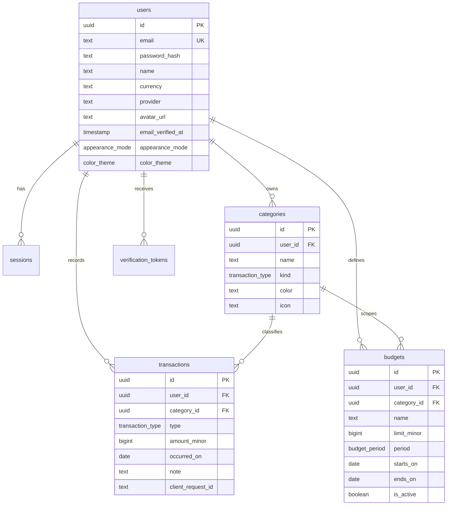

<p align="center">
  
</p>

<p align="center">
  
</p>

# Vira — Personal Expense Tracker

**Created by Nextern.** Vira is a free, open-source, production-oriented full-stack expense tracker built to demonstrate practical application engineering: authentication, authorization, PostgreSQL data modeling, secure money handling, validation, transactional workflows, and production deployment.

[](LICENSE)
[](https://nextjs.org/)
[](https://www.postgresql.org/)
[](https://www.typescriptlang.org/)

## Why Vira?

Vira is intentionally more than a CRUD demo. The project focuses on the engineering details that matter when a small web application moves from a prototype toward production:

- authenticated, user-scoped data access
- real database constraints and transaction-safe workflows
- integer-based monetary calculations instead of floating-point money
- secure password and token handling
- Google OAuth bridged into an application-owned session
- server-side input validation and authorization
- protection against CSRF, duplicate writes, and CSV formula injection
- automated checks through CI and a production health endpoint

## Live Demo

**Production:** https://vira.nextern.ir

**Repository:** https://github.com/nextern-dev/Vira

Vira is designed to be easy to run locally while keeping production concerns explicit in the codebase.

## Features

### Personal finance

- Record income and expenses.
- Organize transactions with user-owned categories.
- Set active budgets and track progress against spending.
- Review spending summaries, category breakdowns, and six-month trends.
- Store amounts as integer minor units for deterministic money calculations.

### Authentication

- Email/password authentication.
- Google OAuth through Auth.js.
- Google email-verification checks before account linking.
- OAuth users are bridged into Vira's own opaque `vira_session` cookie.
- Persistent Google profile avatar storage.
- Email verification with expiring tokens.
- Password reset with short-lived, single-use tokens.
- Password reset invalidates existing application sessions.

### Data tools

- CSV export based on the active ledger filters.
- CSV import with header detection and preview.
- Import validation before persistence.
- Atomic bulk insertion for valid imports.
- Transaction idempotency through a unique client request identifier.

### Application behavior

- Global command palette with keyboard shortcuts.
- Keyboard action for creating a new record.
- Five stored appearance palettes with light/dark modes.
- Appearance synchronization between open browser tabs.
- Responsive application shell for desktop and mobile use.

## Security & Engineering

Security is treated as application behavior rather than a UI feature.

| Area | Implementation |
| --- | --- |
| Authentication | Auth.js v5 for Google OAuth + Vira's opaque application session |
| Authorization | Every protected data query is scoped to the authenticated `user_id` |
| Passwords | `scrypt` hashing with per-password salt and timing-safe comparison |
| OAuth | Requires Google's `email_verified` assertion before linking |
| Sessions | SHA-256 token hashes stored server-side; opaque session cookie is `httpOnly` |
| CSRF | Strict Origin/Host verification for state-changing requests |
| Input validation | Server-side Zod schemas with bounded payloads and rejected invalid fields |
| Money | Integer minor units stored as PostgreSQL `bigint`; no floating-point money math |
| Idempotency | Unique `(user_id, client_request_id)` transaction constraint prevents duplicate writes |
| Categories | User-scoped unique names and protected archived-category rules |
| Imports | Row limits, date validation, category ownership checks, and CSV formula-injection protection |
| Rate limiting | Optional shared Upstash Redis limiter with an in-process fallback |
| Database integrity | Foreign keys, unique constraints, indexes, atomic operations, and transaction boundaries |
| HTTP hardening | CSP, `nosniff`, strict referrer policy, permissions policy, and frame-ancestor restrictions |
| Observability | Structured server logs and `/api/health` readiness endpoint |

## Architecture



The application separates authentication from the application session: Auth.js handles the OAuth exchange, while protected application requests use Vira's server-side opaque session. Domain operations then enforce user ownership before reading or mutating database records.

## Data Model



## Tech Stack

- **Next.js 16** — App Router, Server Components, Route Handlers, Turbopack
- **React 19**
- **TypeScript** — strict mode
- **PostgreSQL** — relational persistence and database constraints
- **Drizzle ORM** — typed SQL access and schema management
- **Auth.js v5** — Google OAuth integration
- **Resend** — transactional authentication email
- **Zod** — server-side input validation
- **Tailwind CSS v4** — application styling
- **Vercel + Neon** — production hosting and PostgreSQL

## Project Structure

```text
src/
├── app/                 # App Router pages and Route Handlers
├── components/          # Reusable application components
├── db/                  # Drizzle schema and database access
├── lib/
│   ├── auth/            # Application session and auth helpers
│   ├── validation/      # Shared validation logic
│   └── ...
└── auth.ts              # Auth.js configuration and OAuth bridge

drizzle/                 # SQL migrations and migration metadata
scripts/                 # Unit tests and project utilities
public/brand/             # Vira brand assets
```

## Local Development

### Requirements

- Node.js 22+
- PostgreSQL 16+ (or a compatible hosted PostgreSQL database)
- npm

### Setup

```bash
# Clone
 git clone https://github.com/nextern-dev/Vira.git
 cd Vira

# Install dependencies
npm install

# Configure environment
cp .env.example .env

# Apply the database schema
npx drizzle-kit push --force

# Run unit tests
node --experimental-strip-types --test scripts/test-units.mjs

# Start development server
npm run dev
```

Then open `http://localhost:3000`.

## Environment Variables

| Variable | Required | Purpose |
| --- | --- | --- |
| `DATABASE_URL` | Yes | PostgreSQL connection string |
| `DB_SSL_REJECT_UNAUTHORIZED` | No | Optional SSL certificate override for specific providers |
| `GOOGLE_CLIENT_ID` | No | Enables Google sign-in |
| `GOOGLE_CLIENT_SECRET` | No | Enables Google sign-in |
| `AUTH_SECRET` | Production | Auth.js secret for the OAuth leg |
| `AUTH_TRUST_HOST` | No | Trust host information when deployed behind a proxy |
| `RESEND_API_KEY` | No | Enables real transactional email delivery |
| `EMAIL_FROM` | No | Sender address for authentication emails |
| `APP_URL` | No | Canonical URL used in generated email links |
| `UPSTASH_REDIS_REST_URL` | No | Shared rate-limiter endpoint |
| `UPSTASH_REDIS_REST_TOKEN` | No | Shared rate-limiter credential |

Never commit real credentials or production secrets to the repository.

## Testing & CI

The repository includes automated checks covering core money, date, password, and application behavior. GitHub Actions runs the project against PostgreSQL and verifies the production build path with schema setup, type checking, linting, tests, build, server startup, and a health probe.

For a quick local check:

```bash
npm run typecheck
npm run lint
node --experimental-strip-types --test scripts/test-units.mjs
npm run build
```

## Brand Assets

Brand files are maintained in `public/brand/`:

| Asset | Path | Purpose |
| --- | --- | --- |
| Brand mark | `public/brand/vira-mark.svg` | Compact application placements |
| Primary logo | `public/brand/vira-logo.svg` | Documentation and light backgrounds |
| Light logo | `public/brand/vira-logo-light.svg` | Dark backgrounds |
| Cover | `public/brand/vira-cover.png` | Repository/social preview |

## Open Source

Vira is released under the **MIT License**. You are free to use, modify, fork, and adapt the project under the terms of the license.

If you build on Vira, attribution is appreciated.

## About Nextern

Vira is an independent open-source project by **Nextern**, a digital product and software brand focused on practical, professionally engineered web applications and developer products.

## License

MIT License — Copyright (c) 2026 Vira contributors / Created by Nextern.
